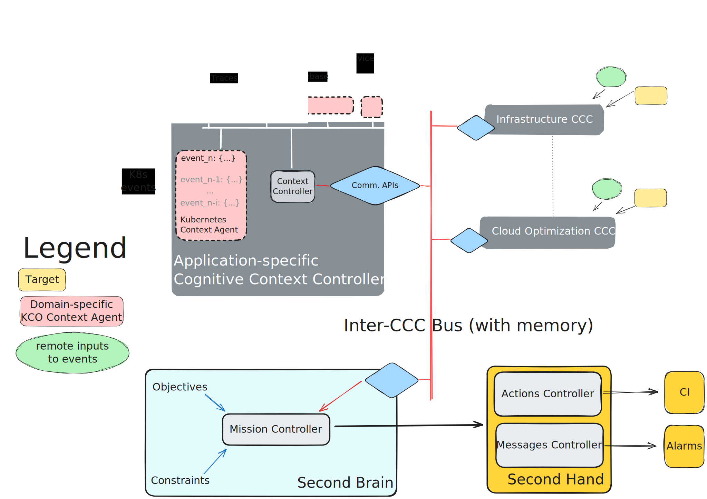

# Kubernetes Cognitive Operator (KCO)
## Overview
KCO is composed of:
- **Cognitive Context Controller (CCC)** feed from Events provided by **Context Agents** to assess the current *State* of the Target.
	- **Context Agents** monitor Events from a **Target** and push valid Events to Comm. APIs. (Examples of invalid messages are e.g., cache hits, liveness probes, etc.)
	- **Remote inputs to events**: sources of telemetry related to Target events. 
	- **Comm. APIs**: expose APIs for historical data retrieval and Pub/Sub interface for live feeding.
- **Second Brain**: is the AI-backed component. It implements a **Mission Controller** which is able to retrieve context via **Inter-CCC Bus and APIs** to satisfy **Objectives** under determined **Constraints**. Outputs include Messages and Actions.
- **Second Hand** handles messages with notifications or alarms via remote systems. Actions are generally triggered via Continuous Integration (CI) system.

# Workflow description
The Cognitive Context Controller (CCC) provides the framework for **Context Agents**. These feed from **Target** APIs and push events to the corresponding **Comm. API**. An example *Kubernetes Context Agent* is shown in the figure:
1. The Agent feeds from Kubernetes Events produced by a Target (*Running K8s-resource*). 
2. Agents push valid messages to the CCC internal Bus.
3. CCC's Context Controller assesses the relevance of the Event to the current Context. If relevant (e.g., non-redundant), the Event upgraded with additional context provided by the Controller and then pushed to the Comm. API.
4. Mission Controller monitors updates from the Target's CCC. It assesses its Events and how they align with Objectives. If either a Message or and Action is required, these are communicated to the Second hand via the appropriate API.
5. Second Hand then generates the Alarm of triggers the corresponding CI API.
## Discussion
This is a very simplistic example in which the capabilities of the Mission Controller are infra valued on purpose. The main short-term goal is to build the underlying infrastructure and development workflow to create a working Proof of Concept (PoC)
# Open questions
- How can LLM or more specifically custom GPTs contribute to: reduction of false positive Alerts, produce and execute resolving actions, automation, etc.

