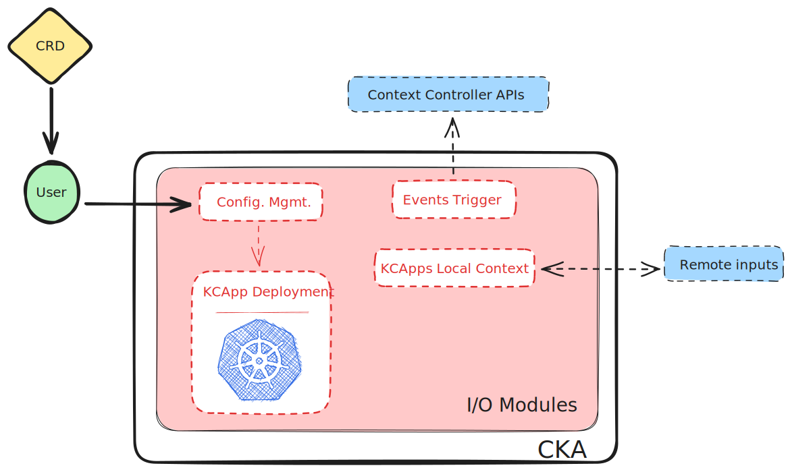

# Kubernetes Context Agent (CKA)
<!-- This agent will concentrate the logic for resolving Kubernetes-related issues. Its core (i.e., Controller) will be implemented as LangGraphs finely tuned to an agent-level Objective under Constraints. -->

## High-level Overview
Generally, KCA defines (deploys and creates context around) Kubernetes Custom Resources for Target Kubernetes Workloads, remote inputs, and Events.

A bit more detail is provided in the figure below.

- **CRD:** defines a KCA Workload (i.e., **KCApp**) that maintains a *Control Loop* with a specific *Target*.
- **User:** placeholder for someone creating a *KCApp* for an specific *Target* and applying it to a KCO-enabled Kubernetes Cluster.
- **Configuration Management:** parses, validates, error-handles and prepares corresponding *KCApp* to deploy.
- **KCApp Deployment:** comprises the KCApp deployment to Kubernetes workflow.
- **KCApps Local Content:** KCA-level AI-enabled agent. *Remote inputs* help create a per-KCApp context.




## KCApps

### TargetWorkload
A *Target* is a Kubernetes Workload. Currently:
- Deployments
- StatefulSets
- Pods

*Events* are Kubernetes Events produced by Targets.

The following is a Kubernetes Event produced by a Pod.

```
LAST SEEN   TYPE     REASON   OBJECT                              MESSAGE
114s        Normal   Pulled   pod/oauth2-proxy-677f9987db-nkbjz   Container image "docker.io/bitnami/oauth2-proxy:7.6.0-debian-12-r16" already present on machine
```

A KCApp with a *Target* of type/kind *Pod* could subscribe to such events.